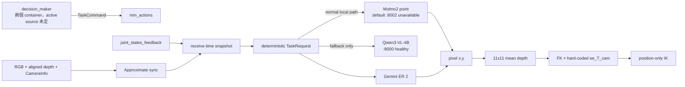

# Phase 0 系統盤點

日期：2026-09-11。狀態：**COMPLETE within the safe read-only scope**。本文件區分 live runtime、live-mounted source、靜態來源與未驗證推論；沒有執行資料擷取、VLM 推論、IK 或 robot action。

## 結論與接合策略

Robot 129 主機是 Jetson AGX Thor。現行 arm pipeline 由 `mm_container` 執行，container 將 `/home/wyattsheu/workspaces/robotic_agent/mm_system/main_ws` 掛到 `/workspace/main_ws`。後續 baseline 與 adapter 應以這份 live-mounted source 為準；`/home/wyattsheu/workspaces/mm_system` 和 `/home/wyattsheu/workspaces/temp/production_client` 只作歷史對照。

目前不能開始可信的影像實驗：相機 viewer 的 `/stats` 回報最後一幀已 stale 約 5117 秒；CameraInfo、RGB/depth header 與頻率查詢沒有收到訊息。不可由 Codex 重啟 camera。Phase 1 必須由人員先恢復 camera，再明確核准第一次 subscriber-only capture。

圖中最後兩段只代表程式鏈已找到，不代表幾何、校正或 motion 已驗證。

## 主機與執行環境

| 項目 | 結果 | 狀態／證據 |
|---|---|---|
| Hardware | NVIDIA Jetson AGX Thor Developer Kit，aarch64，14 CPU，約 122 GiB RAM | CONFIRMED：`lscpu`、device release；2026-09-11 |
| OS / kernel | Jetson Linux R38.4.0；Linux `6.8.12-tegra` | CONFIRMED：`/etc/nv_tegra_release`、`uname -a` |
| GPU | `nvidia-smi` 能辨識 NVIDIA Thor，但不提供一般 desktop 欄位 | CONFIRMED |
| Disk | root 937 GiB，已用 848 GiB，剩 42 GiB，96% | CONFIRMED：`df -h`；資料集需嚴格控量 |
| WORK_DIR git | 本工作區尚未 `git init` | CONFIRMED；Phase 0 無法依規則 commit |
| Network | `generativelanguage.googleapis.com` 連線成功，無 key 的 root endpoint 回 404，connect 0.021 s | CONFIRMED reachability only |
| API key | 本 Codex process 中 `GEMINI_API_KEY`、`GOOGLE_API_KEY` 均缺少 | CONFIRMED presence check；未讀取任何值 |

`mm_container` 內可找到 numpy 1.26.4、PyYAML 6.0.3、requests 2.34.2、google-genai 1.66.0、roboticstoolbox-python 1.1.1、pydantic 2.13.5 與 OpenCV。Open3D、pyrealsense2 不在該 Python 環境；未 source ROS setup 的一次性 metadata shell 找不到 rclpy，但正在運行的 ROS node 證明部署啟動環境已 source ROS。此處只盤點，不安裝套件。

## Repo、container 與 revision

| 角色 | 路徑／container | revision／狀態 |
|---|---|---|
| live arm source | `/home/wyattsheu/workspaces/robotic_agent/mm_system` → `mm_container:/workspace/main_ws` | HEAD `583ada7af4d4c52420d82edac34cdec919228712`；submodule dirty，另有兩張 untracked chair 圖 |
| live decision source | `/home/acm/robotic_agent/robotic_system` → `robotic_agent_system` | HEAD `7c1f248636ab41c1b4f0b558b45a957bfff1c996`；大量 modified/untracked，唯讀 |
| second decision deployment | `/home/acm/robotic/robotic_system` → `robotic_system` | running；來源與 routing 未完成歸屬 |
| older arm checkout | `/home/wyattsheu/workspaces/mm_system` | HEAD `a99e3d757ba31e7cb085e30ae3185f59bf076fe6`；不是 `mm_container` mount |
| umbrella repo | `/home/wyattsheu/workspaces/robotic_agent` | HEAD `16412e609711856db298c565242a9661c07c4e79` |
| standalone local client | `/home/wyattsheu/workspaces/temp/production_client` | 舊 client hash `5261f4…`；live-mounted client 是 `63588c…` |

`mm_container` 的 process 從 `/workspace/main_ws/install/.../mm_actions_node` 啟動，compose start script 會先 `colcon build`。但無權讀 process root 中的 installed Python，因此不能證明當前 process binary 與目前 source byte-for-byte 相同；後文用 **live-mounted source**，不誤稱 installed build。

## ROS live 狀態

唯讀查詢曾成功列出 `/camera`、`/camera_relay`、`/grasp_view`、`/mm_actions`、`/piper_ctrl_single_node`。下列 topic 名與 QoS 已從 graph 確認：

| 資料 | Topic | live 結果 |
|---|---|---|
| RGB | `/camera/color/image_raw` | camera publisher RELIABLE depth 1；mm_actions subscriber RELIABLE depth 10 |
| aligned depth | `/camera/aligned_depth_to_color/image_raw` | camera publisher與 mm_actions subscriber 均存在 |
| intrinsics | `/camera/aligned_depth_to_color/camera_info` | camera publisher與 mm_actions subscriber 均存在 |
| joint feedback | `/joint_states_feedback` | 一次 echo 成功；`joint1`…`joint6`,`gripper`，position 有值，header frame_id 空 |

RGB/depth/CameraInfo 的 `echo --once` 與 `hz` 沒收到資料。`grasp_view` HTTP stats 回報 topic `/camera/color/image_raw/compressed`、viewer size 640×360、`stale=true`。640×360 只能描述 viewer 最後輸出，不能代替 raw RGB/depth resolution。多個 ROS CLI discovery 同時執行後，CycloneDDS 回報 domain 0 participant index 用盡，因此其後 param 查詢失敗；沒有重啟 daemon 或任何既有 process。

## 現行程式契約（live-mounted source）

以下根目錄縮寫 `A=/home/wyattsheu/workspaces/robotic_agent/mm_system/main_ws/src/mm_actions/mm_actions`。

| 項目 | 已確認行為 | file:line |
|---|---|---|
| backend | `VLM_BACKEND` 預設 `local`，支援 `gemini` | `A/mm_actions_node.py:122` |
| Gemini | model `gemini-robotics-er-2-preview`；temperature 0 | `A/reasoning/gemini_client.py:89,118` |
| Gemini point | schema `[y_norm,x_norm]`；parser 回 pixel `[x,y]` | `A/reasoning/gemini_client.py:49,213,223` |
| local models | Qwen3-VL-4B default `:8000`；Molmo2-4B default `:8002` | `A/reasoning/local_pipeline_client.py:111-132` |
| task parsing | deterministic local/JSON tiers；Qwen Stage 1 是 fallback | `A/reasoning/task_request.py:143-250` |
| normal local call | `locate(image_rgb,label)` 呼叫 Molmo2；無點回 typed not-found | `A/reasoning/local_pipeline_client.py:191-255` |
| synchronization | RGB/depth/CameraInfo sync；把 receive timestamp 與當時 latest joint state 存進同一 snapshot | `A/mm_actions_node.py:206-227` |
| synchronization limit | JointState 是另一 subscriber 的 latest sample，沒有按 message timestamp 同步 | `A/mm_actions_node.py:174-178,230-231` |
| intrinsics | 從 CameraInfo K 只取 fx/fy/cx/cy | `A/mm_actions_node.py:218-225` |
| depth | 11×11 finite patch、raw/1000、0.1–3 m、mean | `A/perception/utils.py:39-58` |
| extrinsic | `ee_T_cam` 硬編碼；`base_T_ee @ ee_T_cam` | `A/actions/base_action.py:167-179` |
| grasp | camera z +0.06 m，再 base z −0.03 m | `A/actions/grasp.py:28,71` |
| place | surface point後 base z +0.07 m | `A/actions/place.py`（hash 見 manifest；行為需 Phase 2 再逐式審核） |
| IK | `find_reachable_pose` 預設 position mask，LM IK 開 joint limits | `A/motion/piper_kinematic.py:61-80` |
| grasp truth | runtime `use_force_grasp=false`；寬度命令可被當成完成，無接觸證據 | process args + grasp source；不可當 success label |

目前 `local_pipeline_stage1_qwen` 健康，`/v1/models` 顯示 `Qwen/Qwen3-VL-4B-Instruct`；vLLM `0.19.0+cu130`、Transformers `4.57.3`。預設 port 8002 無 listener，所以 Molmo2 normal local path **UNAVAILABLE**。Ollama 0.22.0 有 `qwen2.5vl:3b`、`qwen3.5:4b`、`qwen3-vl:4b`、`bge-m3`，但現行 client 不使用 Ollama，本階段沒有推論。

Decision source 的 `_transfer_steps` 是 `goto source → grasp → goto destination → place/handover`（`scenario_library.py:126-133`），因此目前場景可跨底盤位置。`execute_batch` 分開 dispatch grasp/place（`decision_maker_node.py:503-532`），arm 每次仍收到單 action TaskCommand（`:1273-1352`）。多點 shared plan 需要新 file/API adapter，不能直接塞入既有單點 action。

## Must-confirm checklist

- [x] **CONFIRMED** live-mounted source paths、repo 與 HEAD；installed build hash仍 UNVERIFIED。
- [ ] **PARTIAL** RGB/depth topic 與 aligned depth存在；resolution、encoding、depth unit/scale因 stale stream UNVERIFIED。
- [x] **CONFIRMED** intrinsics的程式來源為 CameraInfo K；實際值未取得。
- [ ] camera optical frame、base/TCP frame與 calibration provenance/error UNVERIFIED；只找到 hard-coded matrix。
- [x] **CONFIRMED** Gemini與local parser point conventions。
- [x] **CONFIRMED** Gemini model string。
- [x] **CONFIRMED** IK signature、position mask與 joint-limit flag；IK NOT RUN。
- [x] **CONFIRMED** scenario library 的 pick/release 可發生在不同 base locations。
- [x] **CONFIRMED** local model、call function與 endpoints；現場 latency NOT MEASURED，歷史文檔值不作結果。

## Phase 1 前置條件

1. 人員恢復 camera stream；Codex 不重啟既有 process。
2. Wyatt 明確核准首次 subscriber-only capture，並指定不影響其他人的時段。
3. 在 workspace 寫 subscriber-only capture/validation；程式不得含 publisher、service client 或 action client。
4. 第一個 snapshot 先驗證 raw resolution、encoding、depth scale、CameraInfo、frames、timestamp skew與 joint age，再決定是否收 8–12 scenes。
5. 因 root disk 只剩 42 GiB，預設每 scene 一組原始 RGB、16-bit depth與小型 JSON，禁錄 bag/video；設總資料上限。

完整檔案 hash 在 `logs/source_manifest.json`，命令與限制摘要在 `logs/phase0_evidence.md`。
