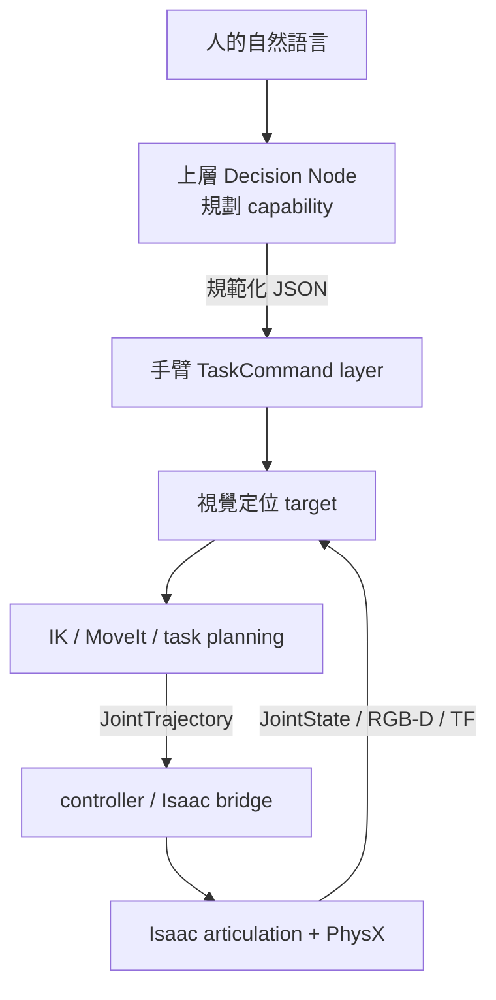

# Robot 129 新手實作教材

更新：2026-09-15  
適用 workspace：`/mnt/HDD4/wyattsheu/handoff/robot129_pro6000_sim_20260913`

這份教材用已經建好的 Robot 129 模擬系統學習。不要重新安裝 Isaac Sim，也不需要 Docker、Thor 或實機。每一章先看概念，再執行一組命令，最後用終端輸出、JSON、圖片或 WebRTC 畫面驗收。

## 先建立正確的系統模型



`Qwen3-VL-8B-Instruct` 位於最上層 Decision Node 一側，用來學習自然語言如何變成 `grasp/place/handover` 等規範化命令。手臂已收到 JSON 時，不需要再跑 Stage 1。你指定的 `feat/active-search-stage1-removal` 分支正是在做這件事。

目前要分清三種完成狀態：

| 路徑 | 目前狀態 | 你能看到什麼 |
|---|---|---|
| ROS `JointTrajectory` → Isaac | 已實際驗證 | WebRTC 中手臂依命令運動，ROS 回傳 `JointState` |
| MoveIt/MTC → 計畫 | 已離線驗證 | JSON 中的軌跡與八個 task stages |
| `TaskCommand` → 視覺定位 → MoveIt → Isaac | 尚未在這個 sim workspace 串成單一 action server | 上游分支可讀；各子系統已有獨立驗收 |
| Qwen → 規範化命令 | 模型已快取、smoke test 已驗證且服務已停止 | JSON 決策；不會直接控制 joint |
| CAN/Piper/RealSense/production domain | 未連接 | 這套教材不會啟動它們 |

## 使用方式

每次學一章。每章結尾如果能回答「我送了什麼、誰收到、如何知道成功」，再往下走。只有第 2、3 章需要持續執行 Isaac；其餘多數內容可在 GPU 忙碌時完成。

所有章節先從這裡開始：

```bash
cd /mnt/HDD4/wyattsheu/handoff/robot129_pro6000_sim_20260913
pwd
```

預期路徑最後一段是 `robot129_pro6000_sim_20260913`。不要把 `cd` 的路徑拆成兩行。

## 第 0 章：先看已完成成果，不啟動 GPU

### 要理解的概念

模擬的成功不能只看「手臂有動」。目前驗收把模型、ROS 隔離、軌跡誤差、抓起、保持、釋放和物體落穩分開記錄。

### 執行

```bash
python3 -m json.tool out/final_acceptance.json | less
python3 -m json.tool out/ros_webrtc_robot129/end_to_end_acceptance.json
ls -lh out/final_demo/robot129_full_simulation.mp4 \
       out/final_demo/contact_sheet.png \
       out/integrated_demo/contact_sheet.jpg
```

按 `q` 離開 `less`。若使用 VS Code Remote SSH，可直接從檔案樹開啟：

- `out/final_demo/contact_sheet.png`：完整流程摘要。
- `out/integrated_demo/contact_sheet.jpg`：Isaac 中各階段影格。
- `out/final_demo/robot129_full_simulation.mp4`：已錄好的模擬影片。

### 驗收

你應看到 `final_acceptance.json` 的 `status` 為 `PASS`。這代表報告中列出的模擬項目通過；它不代表真實 Piper 的 calibration、摩擦或 controller gains 已驗證。

## 第 1 章：用 ROS graph 看懂誰跟誰說話

### 要理解的概念

- **node**：執行中的程式元件。
- **topic**：持續發布的資料流，像關節回授。
- **message type**：資料格式契約。
- **namespace**：名稱隔離；本系統固定 `/robot129_sim`。
- **domain**：DDS 網路隔離；本系統固定 `ROS_DOMAIN_ID=129`。

### 執行

如果 ROS-controlled Isaac 已在跑，可直接執行：

```bash
bash tools/status_robot129_ros_webrtc.sh
bash tools/robot129_ros.sh node list
bash tools/robot129_ros.sh topic list -t
bash tools/robot129_ros.sh topic info /robot129_sim/joint_states -v
bash tools/robot129_ros.sh topic echo /robot129_sim/joint_states --once
```

如果第一個命令顯示 `STOPPED`，先跳到第 2 章啟動，再回來。

### 你要觀察什麼

`joint_states` 的 `name` 應為 `joint1` 到 `joint8`；`position` 是目前模擬位置。前六軸單位是 rad，夾爪 joint7/joint8 是 m，joint8 會鏡射 joint7。

### 驗收問題

1. 哪一個 topic 把命令送進 Isaac？
2. 哪一個 topic 把實際模擬狀態送回 ROS？
3. 為什麼 domain 129 比單靠 topic 名稱更重要？

答案可從 `docs/LOCAL_ROS_CONTROL.md` 核對。

## 第 2 章：在 WebRTC 看 ROS 控制手臂

### 要理解的概念

Isaac 中的機器人是 **articulation**：多個 rigid bodies 由 joints 連起來。ROS 發出的目標不會瞬間改畫面；bridge 會在指定 duration 內插值，PhysX 每個 simulation step 更新姿態，再發布 `JointState`。

### 啟動與觀看

```bash
bash tools/start_robot129_ros_webrtc.sh
```

啟動器會挑當下相對負載較低的 GPU，不等待 GPU 完全空閒。看到 `PASS: ROS-controlled Robot 129 已就緒` 後再連 WebRTC：

```text
Server IP:      140.113.203.85
Signaling port: 49100
Stream port:    47998
```

畫面應是深灰背景、Robot 129 手臂、桌面與方塊。啟動期間不能操作或短暫黑畫面時，先等終端出現 `PASS`；`PASS` 前是在 RTX、ROS bridge 與 WebRTC 暖機。

### 一次跑一組動作

```bash
bash tools/send_robot129_ros_pose.sh inspect --duration 2
bash tools/send_robot129_ros_pose.sh grasp   --duration 2
bash tools/send_robot129_ros_pose.sh lift    --duration 3
bash tools/send_robot129_ros_pose.sh release --duration 2
bash tools/send_robot129_ros_pose.sh home    --duration 3
```

每個命令會送 arm 與 gripper trajectory，等待回授連續五筆穩定，並要求最大誤差小於 `0.015 rad/m`。

### 驗收

```bash
python3 -m json.tool out/ros_webrtc_robot129/last_command.json
tail -n 30 out/ros_webrtc_robot129/server.log
```

你應看到 `status: PASS`、`ros_domain_id: 129`、`hardware_drivers: 0`。WebRTC 裡的動作來自你剛才的 ROS 命令，不是自動 demo。

## 第 3 章：自己建立一筆 JointTrajectory

### 要理解的概念

`JointTrajectory` 主要包含：joint 名稱、目標 position、到達時間。名稱很重要，因為陣列中的數值要靠名稱對應到正確 joint。

先閱讀有註解的教材程式：

```bash
sed -n '1,280p' tutorials/custom_joint_trajectory.py | less
```

### 先預覽，不移動

```bash
python3 tutorials/custom_joint_trajectory.py \
  --positions '0.15,1.25,-1.40,0.0,0.15,0.0,0.035' \
  --duration 2
```

預期 `status` 是 `PREVIEW_ONLY`。程式會讀 active URDF 的 joint limits；越界時直接 `REFUSED`。

### 確認後送到模擬器

```bash
bash tools/robot129_ros_shell.sh
python ../tutorials/custom_joint_trajectory.py \
  --positions '0.15,1.25,-1.40,0.0,0.15,0.0,0.035' \
  --duration 2 \
  --execute
exit
```

### 驗收

終端應回 `PASS`，`max_error` 小於 `0.015`。改一個小角度重跑，觀察 WebRTC 中哪一個 link 改變，再到 URDF 查該 joint 的 axis。

## 第 4 章：讀 URDF、link、joint 與 TF

### 要理解的概念

- **link** 是剛體座標系和幾何的容器。
- **joint** 定義 parent/child、固定 origin、旋轉或平移 axis、limit。
- **visual** 決定外觀；**collision** 給物理與規劃器；**inertial** 給動力學。
- **TF** 是執行時各 frame 的關係；URDF 是產生關係的來源之一。

### 執行

```bash
rg -n '<link|<joint|<parent|<child|<axis|<limit' \
  ros2_ws/src/robot129_description/urdf/robot129.urdf | less

python3 tools/build_robot129_description.py
python3 -m json.tool out/lesson_03/urdf_validation.json
python3 tools/verify_fk_consistency.py
python3 -m json.tool out/lesson_05/fk_consistency.json
```

### 對著程式找一條鏈

```text
base_link → joint1 → link1 → joint2 → ... → joint6 → link6
                                           ├→ gripper_base → joint7/joint8
                                           └→ flange → tool0
```

相機 optical frame 使用影像座標慣例：`+x` 向畫面右、`+y` 向下、`+z` 朝鏡頭前方。不要直接拿一般機器人 link frame 代替 optical frame。

### 驗收

`urdf_validation.json` 應沒有 missing mesh；`fk_consistency.json` 應為 PASS。接著自己回答：改 `joint3` 時，哪些 child links 會一起動？

## 第 5 章：從 URDF 到 USD 與 PhysX

### 要理解的概念

URDF 是 ROS 常用的機器人描述；USD 是 Isaac 場景格式。匯入後，link 會成為 USD prim／rigid body，joint 會成為 articulation joint，drive 負責追目標，PhysX 處理接觸與重力。

### 先看已有產物

```bash
python3 -m json.tool sim/assets/robot129/import_report.json | less
rg -n 'ArticulationRootAPI|PhysicsRevoluteJoint|PhysicsPrismaticJoint|DriveAPI' \
  sim/assets/robot129/robot129/robot129.usda | head -n 80
python3 -m json.tool out/lesson_06/physics_grasp/physics_grasp_report.json | less
```

若你修改 URDF，才需要重匯入：

```bash
bash tools/import_robot129_usd.sh
bash tools/verify_robot129_physics_grasp.sh
```

這兩個命令會使用 GPU。正常學習先讀既有 report 即可。

### 驗收

你要能解釋：mesh 看起來正確，不代表 collision、mass、friction、joint drive 都正確；抓取驗收還要看 lift、hold、release 與 settle。

## 第 6 章：RGB-D、CameraInfo、TF 與 3D 點\n\n即時腕上相機的啟動、SSH tunnel 與瀏覽器畫面見 \`docs/CAMERA_VIEWING.md\`。

### 要理解的概念

畫面像素 `(u,v)` 加上 depth `Z` 和 CameraInfo 內參，才能反投影成 camera frame 的 3D 點：

```text
X = (u - cx) / fx × Z
Y = (v - cy) / fy × Z
Z = depth_in_meter
```

之後用 `T_base_camera` 轉到 robot base frame。RGB、depth、CameraInfo、TF 的時間、frame、單位和 calibration ID 必須一致。

### 執行離線 replay，不用 GPU

```bash
source /mnt/HDD4/wyattsheu/env_robot129_research/bin/activate
cd research
PYTHONDONTWRITEBYTECODE=1 PYTHONPATH=src \
  python scripts/validate_offline_pipeline.py
PYTHONDONTWRITEBYTECODE=1 PYTHONPATH=src \
  python -m unittest discover -s tests -v
cd ..
```

觀看：

- `out/integrated_demo/scene_bundle/rgb.png`
- `out/integrated_demo/scene_bundle/depth.npy`（float32 metric depth）
- `research/out/robot129_sim_replay/latest.json`
- `research/out/robot129_sim_replay/.../grounding/overlay.png`

### 驗收

確認 replay 明確寫 `actual_model_calls=0`、`robot_commands=0`。這章驗證資料與幾何，不是在評估語意模型準確率。

## 第 7 章：規範化 TaskCommand 與移除 Stage 1

### 要理解的概念

上層只要送：

```json
{"task_id":"t-001","action":"grasp","target":"red cube"}
```

手臂 task layer 解析後得到 `(action, target)`，再用 target 做視覺定位。它不需要用 Qwen 再猜一次使用者意圖。

三個 target 規則：

| action | target 的意思 |
|---|---|
| `grasp` | 要夾的物體 |
| `place` | 放置目的地，不是夾爪裡的物體 |
| `handover` | 接收者 `person`，視覺層要找手掌 |

### 跑純資料範例

```bash
python3 tutorials/structured_task_command_demo.py --all
python3 tutorials/structured_task_command_demo.py \
  '{"task_id":"mine-01","action":"place","target":"green area"}'
```

內建最後一筆 `fly` 應被拒絕，這是正確的介面防護。

### 讀你的分支

```bash
git -C references/upstream/mm_system show \
  origin/feat/active-search-stage1-removal:docs/ROS_INTERFACE.md | less

git -C references/upstream/mm_system show \
  origin/feat/active-search-stage1-removal:main_ws/src/mm_actions/mm_actions/reasoning/task_request.py | less

git -C references/upstream/mm_system diff --stat \
  main...origin/feat/active-search-stage1-removal
```

該分支解析優先序是 structured fields → JSON → 暫時的本地英文 parser → 可選 Stage 1 fallback。`STAGE1_FALLBACK_ENABLED=false` 時，常見 JSON 命令不占 Stage 1 GPU。

### 目前整合邊界

`references/upstream/mm_system` 是唯讀參考，不是目前 `ros2_ws` 的 active package。不要執行它的 production launch script，因為其中包含 RealSense、Piper/CAN 與 production ROS 設定。下一個適合實作的 sim 功能，是在 `/robot129_sim/task_command` 建一個 action adapter，把規範化 task command 接到模擬 task executor。

## 第 8 章：MoveIt、MTC 與 controller 的分工

### 要理解的概念

- MoveIt 解 IK、碰撞檢查與路徑規劃。
- MoveIt Task Constructor 把 pick-and-place 拆成 approach、grasp、lift、transport、place、release、retreat。
- controller 接受軌跡並追蹤；Isaac/PhysX 決定實際狀態與接觸結果。

### 執行

```bash
bash tools/verify_moveit_fixed_plan.sh
bash tools/verify_robot129_mtc.sh
python3 -m json.tool out/lesson_09/moveit_fixed_plan.json | less
python3 -m json.tool out/lesson_09/mtc_plan.json | less
```

### 驗收

找出 MTC 的八個 stages，並確認規劃成功和實體抓取成功是兩個不同驗收。現在 MoveIt 的離線計畫已驗證；`FollowJointTrajectory` action 到即時 Isaac 的 adapter 仍是待整合項目。

## 第 9 章：上層 Qwen/vLLM，選修

### 它在這裡做什麼

這章只學「自然語言或影像如何產生規範化決策」。模型不直接發布 joint command。模型已下載，vLLM 預設停止，不會常駐占 GPU。

```bash
bash tools/status_robot129_vllm.sh
bash tools/demo_robot129_vllm.sh
bash tools/status_robot129_vllm.sh
```

`demo_robot129_vllm.sh` 會挑較低負載 GPU、啟動 localhost 服務、跑文字與單張影像 smoke test，再自動停止。預期最後仍是 `STOPPED`，模型 cache 保留。

要讀上層實作，從以下位置開始：

```text
references/upstream/robotic_system/robot_ws/src/decision_maker/
references/upstream/mm_system/main_ws/src/mm_actions/
environment/vllm_server.yaml
out/vllm_robot129/smoke_test.json
```

live grounding 曾成功呼叫模型，但「release pose」在畫面中沒有可辨識目的地，因此 strict schema 拒絕該結果。這是任務語意不完整，不可宣稱完整抓放已由 VLM 驗證。

## 第 10 章：你的第一個完整開發題目

完成前面章節後，第一個真正值得寫的功能是 simulation-only `TaskCommand` adapter：

1. 在 domain 129 建立 `/robot129_sim/task_command` action server。
2. 接受第 7 章的 JSON contract。
3. `grasp/place/handover` 映射到明確的 simulation task state machine。
4. trajectory 仍走 `/robot129_sim/*controller/joint_trajectory`。
5. 用 `JointState`、SceneBundle 與物體 pose 判定結果。
6. 支援 cancel、timeout、busy、invalid_command。
7. 不匯入或啟動任何 Piper/CAN/RealSense hardware backend。

這會把你分支的介面設計和目前可運作的 Isaac ROS bridge 接起來，也是理解完整系統最有效的練習。

## 每次開發的固定循環

```text
讀 contract → 改 source → 跑小測試 → 啟動模擬 → 送一筆命令
→ 讀回授與 report → 停止服務 → 記錄 VERIFIED / UNVERIFIED
```

常用入口：

```bash
# ROS-controlled Isaac
bash tools/start_robot129_ros_webrtc.sh
bash tools/status_robot129_ros_webrtc.sh
bash tools/stop_robot129_ros_webrtc.sh

# ROS CLI
bash tools/robot129_ros.sh node list
bash tools/robot129_ros_shell.sh

# 整體狀態
python3 tools/verify_completed_system.py
bash tools/check_robot129_readiness.sh

# 上層模型，按需啟動並自動停止
bash tools/demo_robot129_vllm.sh
```

## 建議搭配的官方教材

本 workspace 使用 Isaac Sim 6.0.1.0 與 ROS 2 Jazzy。先學官方基礎概念，再回來對照 Robot 129：

1. NVIDIA Isaac Sim Core API：Hello World、Hello Robot、Adding a Manipulator。
2. NVIDIA Robot Setup：stage、articulation、joint drive、URDF importer。
3. NVIDIA ROS 2 tutorials：standalone bridge、joint control、camera、TF、QoS。
4. ROS 2 Jazzy beginner CLI：node、topic、service、action。
5. ros2_control：Controller Manager、hardware interface、JointTrajectoryController。
6. MoveIt：URDF/SRDF、planning scene、planning component，再讀 MTC。

官方網站只提供通用示例；這份教材的每章把概念映射到本機 Robot 129 的實際檔案與驗收。
