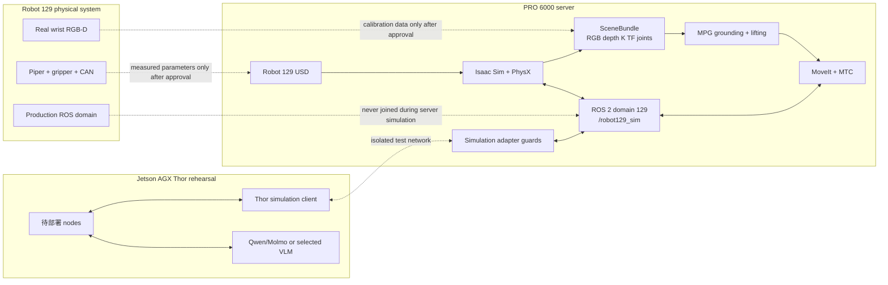

# Robot 129 數位分身開發手冊

更新：2026-09-15  
Workspace：`/mnt/HDD4/wyattsheu/handoff/robot129_pro6000_sim_20260913`

## 1. 目前系統到哪裡

目前可獨立重現的範圍是 **PRO 6000 server-side simulation**：Piper/Robot 129 URDF 與 USD、Isaac PhysX 抓取、RGB-D SceneBundle、隔離 ROS 2、ros2_control、MoveIt、MTC、MPG deterministic replay、Thor adapter local loopback、WebRTC，以及按需啟停的上層 Qwen/vLLM smoke test。總驗收是 `out/final_acceptance.json`。

尚未取得真實量測或外部主機輸入的層，不會用 template 或 simulation estimate 冒充 VERIFIED：完整 live SceneBundle grounding、Thor 跨主機連線、真實相機內外參、Robot 129 hardware revision、實機 controller/contact characterization。

給初學者的實作順序、分階段命令和預期畫面見 `docs/BEGINNER_TUTORIAL.md`。

## 2. 三台系統與資料流



Thor-connected rehearsal 的意思是：**讓將來要部署在 Thor 的程式真的跑在 Thor 上，但 observation 與 command 都接 PRO 6000 的 Isaac 模擬器**。這用來提早找出 aarch64 build、CUDA、記憶體、DDS、網路、clock 與 process restart 問題；不接 CAN、不掛 RealSense USB、不啟動 Piper driver。

## 3. 資料夾架構

```text
robot129_pro6000_sim_20260913/
├── AGENTS.md                         # 此 workspace 的最高層工作規則
├── README.md                         # 交接包入口
├── LEARNING_PATH.md                  # 11 課課綱
├── VALIDATION.md                     # 原始驗收說明
│
├── environment/
│   ├── server_environment.txt        # PRO 6000 硬體與軟體快照
│   ├── version_matrix.yaml           # 已選版本與相容性決策
│   ├── thor_reference.yaml           # Thor 歷史盤點；部署前重查
│   ├── vlm_source_inventory.template.yaml
│   └── inventory/                    # 從原系統帶回、已去秘密的盤點紀錄
│
├── provenance/
│   ├── SHA256SUMS                    # 原始 handoff/vendor checksum
│   ├── prior_source_manifest.json
│   └── PIPER_LICENSE
│
├── robot/
│   ├── vendor/piper_description/     # 唯讀官方 Piper URDF/mesh
│   ├── reference_moveit_config/      # 唯讀參考，不能當 active config
│   └── arm_parameter_summary.yaml    # vendor joint/limit 摘要與未知值
│
├── calibration/
│   ├── registry.yaml                 # active calibration 狀態索引
│   ├── *.template.yaml               # 尚未量測的資料契約
│   ├── current/                      # 通過 review 的 immutable snapshots
│   └── records/                      # 原始量測資料索引與 hashes
│
├── ros2_ws/src/
│   ├── robot129_description/         # 可修改 Robot 129 URDF/Xacro/mesh/config
│   ├── robot129_sim_bringup/         # domain/namespace/controllers/launch
│   ├── robot129_moveit_config/       # SRDF、kinematics、limits、planner
│   ├── robot129_tasks/               # MTC 八階段任務程式
│   └── external/                     # 固定版 MTC source 與 provenance
├── ros2_ws/{build,install,log}/       # colcon 產物，可重建，不手改
│
├── sim/
│   ├── assets/robot129/              # importer 產生的 USD 與 report
│   └── scripts/                      # Isaac 建模、contact、camera、ROS tests
│
├── research/
│   ├── src/mpg/                      # schema、grounding、lifting、VLM clients
│   ├── scripts/                      # capture/replay/evaluation CLI
│   ├── prompts/                      # Stage 0/A/B 與 baseline prompts
│   ├── configs/default.yaml          # 幾何與推論設定
│   ├── tests/                        # 108 個離線 tests
│   └── out/                          # replay/evaluation 產物
│
├── deployment/
│   ├── robot129_adapter.py           # simulation envelope 與 safety guards
│   ├── verify_thor_loopback.py       # 本機 UDP rehearsal
│   ├── thor_rehearsal.template.yaml  # 跨主機必填設定
│   └── config/                       # 通過 review 的 dated rehearsal config
│
├── tools/                            # 日常入口；優先跑這裡的 wrapper
├── docs/
│   ├── DEVELOPMENT_MANUAL.md         # 本手冊
│   ├── ROBOT129_DEMO.md              # Demo 操作
│   ├── 00_system_recon.md            # 原 Robot 129 歷史盤點
│   └── progress/lesson_01..11.md      # 每課證據與未驗證項目
│
├── patches/                          # MTC Jazzy build patches
└── out/                              # 驗收 JSON、log、frames、影片
```

四條規則：

1. 不修改 `robot/vendor` 與 `robot/reference_moveit_config`。
2. 不修改 `ros2_ws/build`、`install`、`log`；它們由 colcon 重建。
3. 真實量測完成前，只改 template 或 simulation config，不建立假的 VERIFIED 檔。
4. 每次修改後跑該層驗收，再跑 `tools/verify_completed_system.py`。

## 4. 開發環境怎麼進

### 4.1 固定工作目錄

```bash
cd /mnt/HDD4/wyattsheu/handoff/robot129_pro6000_sim_20260913
```

### 4.2 Research／MPG

```bash
source /mnt/HDD4/wyattsheu/env_robot129_research/bin/activate
cd research
PYTHONDONTWRITEBYTECODE=1 PYTHONPATH=src python -m unittest discover -s tests -v
```

這個環境處理 Pillow、NumPy、requests、YAML、SceneBundle、grounding 與 lifting，不 source ROS，也不載入 Isaac。

### 4.3 ROS 2／MoveIt

互動 shell：

```bash
/mnt/HDD4/wyattsheu/tools/micromamba/micromamba run \
  -p /mnt/HDD4/wyattsheu/env_robot129_ros bash

source /mnt/HDD4/wyattsheu/env_robot129_ros/setup.bash
source /mnt/HDD4/wyattsheu/handoff/robot129_pro6000_sim_20260913/ros2_ws/install/setup.bash
export ROS_DOMAIN_ID=129
export ROS_NAMESPACE=/robot129_sim
```

驗證：

```bash
printenv ROS_DOMAIN_ID ROS_NAMESPACE
ros2 pkg prefix robot129_description
ros2 pkg prefix robot129_moveit_config
```

### 4.4 ROS 控制 Isaac + WebRTC

持續開發服務、topic、姿態命令與兩個終端機工作流見 `docs/LOCAL_ROS_CONTROL.md`。這條服務保持 HOME，等待 domain 129 的 trajectory topic；本機開發不需要連接 Thor 或 Robot 129 實機。

```bash
bash tools/start_robot129_ros_webrtc.sh
bash tools/send_robot129_ros_pose.sh inspect
bash tools/status_robot129_ros_webrtc.sh
```

### 4.5 Isaac Sim


不要直接猜 Isaac Python 路徑；優先跑 `tools/*.sh`。wrapper 固定使用：

```text
IsaacLab: /mnt/HDD4/wyattsheu/IsaacLab
Isaac Sim: 6.0.1.0
IsaacLab: 3.0.0
```

GPU wrapper 會依 utilization 與 VRAM 選較低負載卡，不等待空閒門檻。

## 5. 修改哪裡、跑什麼

| 工作 | 修改位置 | 驗收命令 | 主要產物 |
|---|---|---|---|
| Piper/Robot link、joint、frame | `tools/build_robot129_description.py`、`ros2_ws/src/robot129_description` | `python3 tools/build_robot129_description.py` | `out/lesson_03/urdf_validation.json` |
| URDF → USD importer | `sim/scripts/import_robot129_urdf.py` | `bash tools/import_robot129_usd.sh` | `sim/assets/robot129/robot129/robot129.usda` |
| FK | description/importer | `python3 tools/verify_fk_consistency.py` | `out/lesson_05/fk_consistency.json` |
| 夾爪 physics/contact | `sim/scripts/verify_robot129_physics_grasp.py` | `bash tools/verify_robot129_physics_grasp.sh` | Lesson 6 report/video |
| 模擬 camera/SceneBundle | `sim/scripts/run_robot129_demo.py` | `bash tools/run_robot129_demo.sh` | `out/integrated_demo/scene_bundle` |
| ROS controllers | `robot129_sim_bringup/config` 與 `launch` | `bash tools/verify_ros2_control_mock.sh` | Lesson 8 reports |
| ROS → Isaac | `sim/scripts/verify_robot129_ros_roundtrip.py` | `bash tools/verify_robot129_ros_roundtrip.sh` | `ros_isaac_roundtrip.json` |
| MoveIt | `robot129_moveit_config/config` | `bash tools/verify_moveit_fixed_plan.sh` | `moveit_fixed_plan.json` |
| MTC stages | `robot129_tasks/src/robot129_mtc_plan.cpp` | `bash tools/verify_robot129_mtc.sh` | `mtc_plan.json` |
| MPG/schema/prompt | `research/src/mpg`、`prompts`、`configs` | research tests + replay | `research/out/...` |
| Thor protocol | `deployment/robot129_adapter.py` | `python3 deployment/verify_thor_loopback.py` | Lesson 11 report |
| 最終影片 | `tools/build_final_demo_video.py` | `python3 tools/build_final_demo_video.py` | `out/final_demo` |
| 全系統摘要 | 不修改產物 | `python3 tools/verify_completed_system.py` | `out/final_acceptance.json` |
| 部署 readiness | templates/current configs | `bash tools/check_robot129_readiness.sh --require TARGET` | `out/readiness/development_readiness.json` |

ROS package 修改後：

```bash
/mnt/HDD4/wyattsheu/tools/micromamba/micromamba run \
  -p /mnt/HDD4/wyattsheu/env_robot129_ros bash -lc '
source /mnt/HDD4/wyattsheu/env_robot129_ros/setup.bash
cd /mnt/HDD4/wyattsheu/handoff/robot129_pro6000_sim_20260913/ros2_ws
colcon build --symlink-install --packages-select \
  robot129_description robot129_sim_bringup robot129_moveit_config robot129_tasks
'
```

## 6. 底層資料怎麼流

### 6.1 URDF、USD、TF

URDF joint 的 `origin` 是 parent link 到 child joint/frame 的固定變換；joint axis 再根據 joint value 產生動態變換。USD importer 將這些轉成 PhysX articulation、rigid bodies、collision shapes 與 drives。

目前主要 frame chain：

```text
world
└── base_link
    └── link1 ─ joint2 ─ link2 ─ joint3 ─ link3
        ─ joint4 ─ link4 ─ joint5 ─ link5 ─ joint6 ─ link6
          ├── gripper_base
          │   ├── joint7 → link7
          │   ├── joint8 → link8     # mimic joint7 × -1
          │   ├── tcp
          │   └── camera_mount → camera_link → camera_color_optical_frame
          └── flange → tool0
```

相機 optical frame 遵守影像幾何：`+x` 向影像右、`+y` 向影像下、`+z` 向鏡頭前方。一般 robot link frame 不能直接當 optical frame。

### 6.2 Pixel、depth 與 3D

對 rectified、與 color 對齊的 depth：

```text
X_camera = (u - cx) / fx × Z
Y_camera = (v - cy) / fy × Z
Z_camera = depth_in_meter
p_base   = T_base_camera × [X_camera, Y_camera, Z_camera, 1]
```

因此至少要同時知道：相同 timestamp 的 RGB/depth、正確 `K=[fx,fy,cx,cy]`、depth scale、depth 定義、`T_base_camera` 的方向與 calibration ID。只知道畫面尺寸不能做 3D。

### 6.3 Command 路徑

```text
MTC/MoveIt trajectory
  → FollowJointTrajectory action
  → ros2_control arm_controller / gripper_controller
  → simulation hardware interface or Isaac bridge
  → articulation joint targets
  → PhysX state
  → JointState feedback
```

`joint7` 是可命令夾爪 joint；`joint8` 是 mimic follower。MoveIt group 可以知道兩指幾何，但 controller 不應要求 `joint8/position` command interface。

### 6.4 MPG 路徑

```text
instruction + RGB
  → Stage 0/A：物件、目的地、角色與 primitive sequence
  → Stage B：GRASP/WAYPOINT/RELEASE 2D points
  → depth lifting
  → camera 3D
  → T_base_camera
  → world/base 3D target
  → IK/MoveIt/MTC
  → controller
  → PhysX
  → new observation
```

每一箭頭都有自己的 status。JSON 可解析不代表點位正確；點位正確不代表 IK、collision、controller 或 grasp 成功。

## 7. Live vLLM/VLM：需要什麼

### 7.1 原系統目前已知的歷史資訊

來源是 `docs/00_system_recon.md`，日期 2026-09-11/12，搬遷前必須重查：

- Robot 129 主機：Jetson AGX Thor、aarch64、Jetson Linux R38.4.0。
- live arm source：`/home/wyattsheu/workspaces/robotic_agent/mm_system/main_ws`。
- Qwen container：`local_pipeline_stage1_qwen`，模型 `Qwen/Qwen3-VL-4B-Instruct`，歷史 endpoint `:8000`。
- Molmo container：`local_pipeline_stage2_molmo2`，模型 `allenai/Molmo2-4B`，歷史 endpoint `:8002`。
- 歷史 runtime：vLLM `0.19.0+cu130`、Transformers `4.57.3`。
- 現行正常 local 路徑主要用 Molmo 定位；Qwen 是 task/role 或 fallback。不能把兩者混成一個模型成績。
- OpenAI-compatible request 使用 `/v1/chat/completions`，image 以 base64 data URL 傳入。

官方 vLLM 文件確認其 OpenAI-compatible server 支援 Chat API；multimodal request 使用 image content，且 `--limit-mm-per-prompt` 應明確限制輸入數量：

- <https://docs.vllm.ai/en/latest/serving/online_serving/openai_compatible_server/>
- <https://docs.vllm.ai/en/stable/examples/generate/multimodal/>
- <https://docs.vllm.ai/en/stable/cli/serve/>

### 7.2 還要從原系統取得

填入 `environment/vlm_source_inventory.yaml`：

1. container image reference 與 immutable digest。
2. model exact revision／snapshot hash；只有 model ID 不足以重現。
3. 完整但去秘密的 launch arguments：dtype、quantization、tensor parallel、GPU memory utilization、max model length、multimodal limit、trust-remote-code、served model name。
4. vLLM、Transformers、PyTorch、Python、CUDA、JetPack 精確版本。
5. chat template 內容或 hash。
6. `/v1/models` 結果，以及一份去圖片／去秘密的 request-response shape。
7. Qwen/Molmo point coordinate convention：`x/y` 或 `y/x`、0–1000 如何映射 W/H。
8. timeout、retry、concurrency、cache、call ledger 與 healthcheck policy。
9. container bind address、實際允許的 client network、reverse proxy；不能只靠 vLLM `--api-key` 暴露到不可信網路。
10. live source commit 與 installed artifact hash，排除 source/build drift。

在 Robot 129／Thor 上執行只讀盤點，不會啟動或停止任何 container：

```bash
cd <這份 workspace>
bash tools/collect_original_system_readonly.sh /tmp/robot129_source_inventory.txt
```

如要讓腳本加入目前 ROS graph 做 read-only topic discovery，必須明確選擇：

```bash
bash tools/collect_original_system_readonly.sh \
  /tmp/robot129_source_inventory.txt --ros-readonly
```

第二條會加入原系統當前 ROS domain，因此不應在 production 未協調時執行。腳本不讀 container environment，避免把 API key 寫入檔案。

### 7.3 PRO 6000 端目前狀態與接入順序

已建立獨立 `/mnt/HDD4/wyattsheu/env_robot129_vllm`，固定 Qwen3-VL-8B-Instruct snapshot、localhost:8001、served aliases、GPU 選擇與限制。文字及單張影像 smoke test PASS，報告在 `out/vllm_robot129/smoke_test.json`；服務已停止。它是上層決策／VLM 學習環境，不是手臂 controller，也不需要為規範化 JSON TaskCommand 執行 Stage 1。

按需驗證：

```bash
bash tools/status_robot129_vllm.sh
bash tools/demo_robot129_vllm.sh
bash tools/status_robot129_vllm.sh
```

完整接入仍依以下順序：

1. 從原系統取得 inventory，保存舊 baseline 的 exact revision。
2. 將舊 baseline 與目前 PRO 6000 runtime 分成不同 experiment ID。
3. 先測 `/v1/models` 和固定 RGB smoke inference。
4. 再跑 SceneBundle grounding，確認 schema、cache 與 ledger。
5. 最後才跑多 scene evaluation；模型輸出不直接發控制命令。

Readiness：

```bash
cp environment/vlm_source_inventory.template.yaml environment/vlm_source_inventory.yaml
# 填寫、review，status 改為 VERIFIED 後：
bash tools/check_robot129_readiness.sh --require vlm
```

## 8. Thor-connected rehearsal：需要什麼

### 8.1 它測什麼

- x86_64 server 的程式能否在 aarch64 Thor 重建。
- Thor 上實際待部署 nodes 的 CPU/GPU/RAM 與啟動時間。
- Thor ↔ PRO 6000 的 network latency、packet loss、DDS discovery 與 clock offset。
- stale message、重複 sequence、server disconnect、Thor process restart。
- 任何錯誤都不能切到 `piper_hardware` backend。

### 8.2 原系統要提供的資料

填入 `deployment/thor_rehearsal.yaml`：

- Thor hostname、test-network IP/interface；PRO 6000 在同一 test network 的 IP。
- ROS distro、`RMW_IMPLEMENTATION`、DDS vendor/config、靜態 peers 或 discovery server。
- production domain ID，證明它不是 129；測試固定 129 與 `/robot129_sim`。
- 哪些 source commit、nodes、build command、launch command 要在 Thor 執行。
- Jetson Linux、JetPack、CUDA、Python、PyTorch 與 container runtime versions。
- 需要開放的單向 ports、firewall 命令與 rollback。
- clock sync 方式與容許 offset。
- Thor container/devices 清單，證明沒有 `/dev/can*`、RealSense/video USB passthrough。
- owner、停止命令、失聯處理與輸出 report 位置。

NVIDIA 的 Thor/JetPack 文件要用來核對當下 BSP 與 JetPack；本 bundle 的 R38.4.0 只是歷史記錄：

- <https://docs.nvidia.com/jetson/agx-thor-devkit/user-guide/latest/index.html>
- <https://docs.nvidia.com/jetson/>

ROS domain 透過 DDS domain 分隔 discovery，但不能取代實體 test network 與裝置隔離：<https://docs.ros.org/en/lyrical/Concepts/Intermediate/About-Domain-ID.html>。

### 8.3 實際執行階段

現在可安全跑的 server local contract：

```bash
python3 deployment/verify_thor_loopback.py
```

要做跨主機前：

```bash
cp deployment/thor_rehearsal.template.yaml deployment/thor_rehearsal.yaml
bash tools/check_robot129_readiness.sh --require thor
```

validator 通過後，才建立 dated config 放進 `deployment/config/`。目前沒有 Thor IP 與 approved network，所以沒有提供會直接 bind 公網或加入 production DDS 的一鍵命令。

## 9. 真實 camera 與新增相機

### 9.1 五個不同問題

1. **Device identity**：D435i/D455/其他型號、serial、firmware。
2. **Intrinsics**：每個 resolution/profile 的 K、D、R、P；換解析度要重查。
3. **Depth mapping**：raw unit 到 meter 的 scale，以及是否已 aligned 到 color。
4. **Extrinsics**：robot end-effector 到 camera optical frame 的 hand-eye transform。
5. **Temporal alignment**：RGB/depth/CameraInfo/JointState/TF 的 timestamp 與最大 skew。

### 9.2 新增一台相機的正確順序

1. 建立 camera ID，例如 `wrist_d435i_01`；記 exact model、serial 的遮罩值與 firmware。
2. 決定 frame：`<id>_mount` → `<id>_link` → `<id>_color_optical_frame`。
3. 實測支架尺寸、質量、parent link 與大致 transform，先寫 `physical_measurements.yaml`。
4. 從實際 `sensor_msgs/CameraInfo` 保存 K/D/R/P、frame、profile；不要抄 viewer 顯示尺寸。
5. 驗證 aligned depth 與 color 是同一 pixel grid，保存 encoding 和 depth scale。
6. 用 calibration board 做 RGB intrinsic/reprojection 驗證。ROS 官方 `camera_calibration` 以棋盤內角點數和實際 square size 啟動，例如：

```bash
ros2 run camera_calibration cameracalibrator \
  --size 8x6 --square 0.030 \
  image:=/<camera_namespace>/color/image_raw \
  camera:=/<camera_namespace>/color
```

`0.030` 只是命令格式示例；必須換成你用卡尺量到的正方形邊長。官方流程：<https://docs.ros.org/en/kilted/p/camera_calibration/doc/tutorial_mono.html>。

7. 做 eye-in-hand hand-eye calibration：固定 board 在 base/world，移動手臂取得多個 `T_base_ee(q_i)` 與 `T_camera_target(i)`，解出固定 `T_ee_camera`。姿態需要涵蓋不同旋轉軸，不能只平移。
8. 以未參與求解的 known 3D points 驗證 reprojection 與 deprojection；保存 mean/p95 pixel error、3D error 與原始 dataset hash。
9. 將 VERIFIED transform 寫入 `calibration/extrinsics.yaml`，再由 description generator 引用；不要直接手改 generated URDF。
10. 在 Isaac 加同名 camera prim，設定對應 K/FOV、resolution、clipping range 與 optical frame。
11. 更新 SceneBundle capture topic/frame，跑 `validate_scene.py` 和 Robot129 replay。
12. 加入 MoveIt collision geometry：camera body、支架與線材保守 envelope。

RealSense ROS wrapper 的目前參數以 `align_depth.enable` 啟用對 color 的 depth alignment，stream profile 與 frame naming 應從實際 wrapper 版本確認：<https://github.com/realsenseai/realsense-ros>。

### 9.3 原系統只讀資料命令

這些命令只能在已協調的 Robot 129 terminal 執行；它們會加入當前 ROS graph，但不 publish command：

```bash
ros2 topic info -v /camera/color/image_raw
ros2 topic info -v /camera/aligned_depth_to_color/image_raw
ros2 topic echo --once /camera/aligned_depth_to_color/camera_info
ros2 topic hz /camera/color/image_raw
ros2 topic hz /camera/aligned_depth_to_color/image_raw
ros2 topic echo --once /joint_states_feedback
ros2 run tf2_ros tf2_echo <base_frame> <camera_color_optical_frame>
```

不要在不清楚 ROS domain 時先跑。先記錄：

```bash
printenv ROS_DISTRO ROS_DOMAIN_ID RMW_IMPLEMENTATION
```

### 9.4 標定檔與 gate

```bash
cp calibration/camera_intrinsics.active.template.yaml calibration/camera_intrinsics.yaml
cp calibration/extrinsics.active.template.yaml calibration/extrinsics.yaml
cp calibration/camera_registration.template.yaml calibration/camera_registration.yaml
```

完成量測、填入 provenance、誤差與 reviewer 後才能改 `status: VERIFIED`：

```bash
bash tools/check_robot129_readiness.sh --require camera
bash tools/validate_camera_calibration.sh
```

第二個命令會檢查 K、depth scale、pixel grid、4×4 齊次矩陣、SO(3) 旋轉、frame direction 與誤差數值。

現有 `ee_T_cam` 只在 `extrinsics.template.yaml` 保存為 legacy candidate。變數名稱無法證明 parent/child frame、方向與誤差，因此不允許直接啟用。

## 10. Controller、contact 與 hardware revision

### 10.1 Hardware revision

需要抄錄或拍照索引：Piper exact model/revision、arm/gripper serial 遮罩、firmware、motor driver、額定 payload、夾爪型號、base/end-effector/camera bracket revision、實際 opening width、URDF/source commit。

```bash
cp calibration/hardware_revision.template.yaml calibration/hardware_revision.yaml
cp calibration/physical_measurements.active.template.yaml calibration/physical_measurements.yaml
cp calibration/gripper_mapping.active.template.yaml calibration/gripper_mapping.yaml
```

### 10.2 Controller characterization

不是「找一組 PID 就填進 Isaac」。要在人工監督與低速限制下記錄：

- command/action 與 feedback topic、unit、update rate、clock。
- 每軸 unloaded step response、trajectory tracking、payload tracking。
- latency、RMSE、peak error、overshoot、settling time。
- cancel latency、watchdog timeout、position/orientation tolerance 與 stable duration。
- source commit 與 installed artifact hash。

資料契約：

```bash
cp calibration/controller_characterization.template.yaml \
   calibration/controller_characterization.yaml
```

### 10.3 Contact characterization

必須先知道實機是否有力、電流、位置停滯或其他 contact signal。只靠「夾爪命令完成」不能當 grasp truth。測試記錄不同已知質量／材質物體的 command width、peak signal、hold time、slip、成功／誤判，再把估計摩擦與 stiffness 映射回模擬。

```bash
cp calibration/contact_characterization.template.yaml \
   calibration/contact_characterization.yaml
```

完成並 review 後：

```bash
bash tools/check_robot129_readiness.sh --require hardware
```

目前 Lesson 6 的 friction 4.0/3.0 與 gains 只是 simulation estimate，不能複製成實機 controller 參數。

## 11. 為什麼 CAN、Piper SDK、RealSense USB、production ROS 沒連

這不是「系統少做了啟動」，而是刻意的邊界：

- **CAN** 是真正 actuator transport；接上就可能讓命令到達馬達。
- **Piper SDK/driver** 會把 ROS/controller action 轉成硬體命令。
- **RealSense USB** 是真實資料來源，也涉及 production process 與 device ownership。
- **production ROS domain** 讓節點彼此 discovery；錯誤 namespace 仍可能碰到真實 topic/action。

目前 server 只允許 `backend=isaac_sim`、domain 129、namespace `/robot129_sim`。adapter 會拒絕 `piper_hardware`、domain 0、過期 command、stale observation 與重複 sequence。

未來實機階段必須建立另一份明確的 launch/config，不能把 simulation backend 政名後直接使用。正式切換至少需要：人工 supervisor、硬體 E-stop、速度／力限制、workspace collision、freshness watchdog、dry-run、單軸低速驗證與 rollback。

## 12. 每天開發的最短流程

開始：

```bash
cd /mnt/HDD4/wyattsheu/handoff/robot129_pro6000_sim_20260913
nvidia-smi
bash tools/check_robot129_readiness.sh --require simulation
```

修改後先跑該層 wrapper。最後：

```bash
source /mnt/HDD4/wyattsheu/env_robot129_research/bin/activate
cd research
PYTHONDONTWRITEBYTECODE=1 PYTHONPATH=src python -m unittest discover -s tests -v
cd ..
bash tools/verify_sources_post_build.sh
python3 tools/verify_completed_system.py
```

看影片／WebRTC：

```bash
mpv out/final_demo/robot129_full_simulation.mp4
bash tools/start_robot129_webrtc.sh
bash tools/status_robot129_webrtc.sh
bash tools/stop_robot129_webrtc.sh
```

`tools/verify_bundle.sh` 是 pristine handoff 檢查；colcon `--symlink-install` 後會因 build/install symlinks 預期失敗。開發期間用 `tools/verify_sources_post_build.sh` 驗證 provenance。

## 13. Readiness 狀態怎麼看

```bash
bash tools/check_robot129_readiness.sh --require simulation  # 現在 PASS
bash tools/check_robot129_readiness.sh --require vlm         # 缺 inventory 時 exit 2
bash tools/check_robot129_readiness.sh --require thor        # 缺 approved config 時 exit 2
bash tools/check_robot129_readiness.sh --require camera      # 缺 VERIFIED calibration 時 exit 2
bash tools/check_robot129_readiness.sh --require hardware    # 缺實測資料時 exit 2
```

輸出固定在 `out/readiness/development_readiness.json`。這能防止「檔案存在」被誤解為「資料已驗證」。
