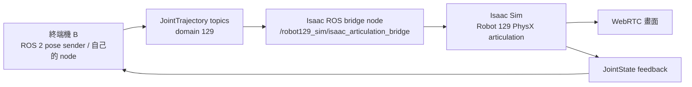

# Robot 129 本機 ROS 2 控制 Isaac Sim

更新：2026-09-15  
Workspace：`/mnt/HDD4/wyattsheu/handoff/robot129_pro6000_sim_20260913`

這條開發路徑全部在 PRO 6000 server 上執行。ROS 2 與 Isaac Sim 用本機 DDS 通訊，不需要 SSH 到 Robot 129 或 Thor，也不會載入 CAN、Piper SDK、RealSense 或任何硬體 driver。

## 1. 現在的控制架構



橋接程式會保持 HOME，收到 ROS 命令才移動。它把 arm 的 `joint1..joint6` 與 gripper 的 `joint7` 寫入同一具 Isaac articulation；`joint8` 自動使用 `-joint7`，形成左右對稱夾爪。命令完成後，sender 會讀回 `/robot129_sim/joint_states` 並檢查實際誤差。

隔離設定固定為：

- `ROS_DOMAIN_ID=129`
- namespace `/robot129_sim`
- backend `isaac_sim`
- hardware drivers `0`

## 2. 最快 Demo：一個命令跑完整段

```bash
cd /mnt/HDD4/wyattsheu/handoff/robot129_pro6000_sim_20260913
bash tools/demo_robot129_local_ros.sh
```

這會啟動 ROS-controlled Isaac/WebRTC，再由本機 ROS 依序送出 `inspect → grasp → lift → release → home`。每一段都要看到 JSON 的 `"status": "PASS"`；結束後模擬器會繼續執行，方便你留在 WebRTC 中觀察。

WebRTC Client：

- Server IP：`140.113.203.85`
- Signaling port：`49100`
- Stream port：`47998`

這是「ROS 控制展示」。`tools/start_robot129_webrtc.sh` 是會自行抓取與放下的 physics 驗收展示；開發 ROS 時不要用錯入口。

## 3. 開發時的兩個終端機

### 終端機 A：啟動 Isaac、ROS bridge 與 WebRTC

```bash
cd /mnt/HDD4/wyattsheu/handoff/robot129_pro6000_sim_20260913
bash tools/start_robot129_ros_webrtc.sh
```

預期看到：

```text
初始化中：ROS-controlled Isaac Sim ...
暖機中：RTX、WebRTC、ROS node
PASS: ROS-controlled Robot 129 已就緒；現在保持 HOME，等待 ROS 命令。
```

啟動器會直接挑當下負載較低的 GPU，不等待 GPU 完全空閒。若自動抓取展示正在執行，它會先停止該展示，避免兩個 Isaac 程序占用同一組 WebRTC ports。

### 終端機 B：送一組已知姿態

```bash
cd /mnt/HDD4/wyattsheu/handoff/robot129_pro6000_sim_20260913
bash tools/send_robot129_ros_pose.sh inspect --duration 2
bash tools/send_robot129_ros_pose.sh grasp --duration 2
bash tools/send_robot129_ros_pose.sh lift --duration 3
bash tools/send_robot129_ros_pose.sh release --duration 2
bash tools/send_robot129_ros_pose.sh home --duration 3
```

`--duration` 是插值到目標姿態的秒數。每個命令會等待 Isaac subscriber、發布 arm 與 gripper trajectory、讀回 joint state，並要求最大誤差小於 `0.015 rad/m` 且連續五筆穩定。

## 4. 查看 ROS graph 與回授

不必自己設定 ROS 環境，使用 wrapper 即可：

```bash
cd /mnt/HDD4/wyattsheu/handoff/robot129_pro6000_sim_20260913
bash tools/robot129_ros.sh node list
bash tools/robot129_ros.sh topic list -t
bash tools/robot129_ros.sh topic echo /robot129_sim/joint_states --once
```

主要介面：

| 方向 | Topic | Type | 意義 |
|---|---|---|---|
| ROS → Isaac | `/robot129_sim/arm_controller/joint_trajectory` | `trajectory_msgs/msg/JointTrajectory` | `joint1..joint6` |
| ROS → Isaac | `/robot129_sim/gripper_controller/joint_trajectory` | `trajectory_msgs/msg/JointTrajectory` | `joint7`；joint8 自動鏡射 |
| ROS → Isaac | `/robot129_sim/joint_trajectory` | `trajectory_msgs/msg/JointTrajectory` | 方便測試的 `joint1..joint7` 合併入口 |
| Isaac → ROS | `/robot129_sim/joint_states` | `sensor_msgs/msg/JointState` | 八軸實際模擬位置與速度 |

## 5. 寫自己的 ROS 2 node

只需要「丟六軸角度／開合夾爪」這種最小介面，不想自己處理 ROS publisher／feedback，
直接用 `tools/robot129_control_api.py`（`set_joint_positions` / `open_gripper` / `close_gripper`），
見 [`docs/CONTROL_API_FOR_SENIOR.md`](CONTROL_API_FOR_SENIOR.md)。以下是自己寫 node 時的環境與參考範例。

進入已隔離且 source 完成的互動 shell：

```bash
cd /mnt/HDD4/wyattsheu/handoff/robot129_pro6000_sim_20260913
bash tools/robot129_ros_shell.sh
```

進去後會位於 `ros2_ws/`，並已設定 domain 129。新的 ROS package 放在 `ros2_ws/src/`，可參考 `tools/send_robot129_ros_pose.py` 的 publisher、discovery 與 feedback 驗證方式。

修改 package 後，在這個 shell 內建置：

```bash
colcon build --symlink-install --packages-select \
  robot129_description robot129_sim_bringup \
  robot129_moveit_config robot129_tasks
source install/setup.bash
```

主要開發位置：

```text
ros2_ws/src/robot129_description/   URDF/Xacro、mesh、joint limit
ros2_ws/src/robot129_sim_bringup/   ROS namespace、controller config、launch
ros2_ws/src/robot129_moveit_config/ SRDF、planning、kinematics
ros2_ws/src/robot129_tasks/         MoveIt Task Constructor 任務
sim/scripts/run_robot129_ros_webrtc.py
                                    ROS topic ↔ Isaac articulation 即時橋接
tools/send_robot129_ros_pose.py     最小 ROS publisher 與 feedback 驗證範例
```

目前持續服務接受 `JointTrajectory` topic，適合快速開發自己的 policy、teleop 或 task node。既有 `mock_control.launch.py` 使用 ros2_control `GenericSystem`，用途是驗證 controller/action 介面，並不會驅動 WebRTC 裡的 Isaac。MoveIt 的規劃已可離線驗證；若要讓 MoveIt `FollowJointTrajectory` action 直接執行到 Isaac，還需要增加 action adapter，這是下一層本機整合。

## 6. 狀態、紀錄與停止

```bash
cd /mnt/HDD4/wyattsheu/handoff/robot129_pro6000_sim_20260913
bash tools/status_robot129_ros_webrtc.sh
tail -f out/ros_webrtc_robot129/server.log
bash tools/stop_robot129_ros_webrtc.sh
```

驗收與最近一次命令：

```text
out/ros_webrtc_robot129/acceptance.json
out/ros_webrtc_robot129/end_to_end_acceptance.json
out/ros_webrtc_robot129/last_command.json
out/ros_webrtc_robot129/viewport_probe.png
```

## 7. 常見判斷

- 一進畫面就自動抓取：啟動了 `start_robot129_webrtc.sh`；停止後改用 `start_robot129_ros_webrtc.sh`。
- ROS 看不到 node/topic：先確認 ROS-controlled service 是 RUNNING，再用 `tools/robot129_ros.sh`，不要自行 source 到 domain 0。
- 命令被拒絕：joint 名稱、數量、有限值、joint limit 或 duration 不符合 bridge guard。
- 畫面正在動但 sender FAIL：查看 `last_command.json` 與 `server.log`，分辨 DDS discovery、命令驗證或 articulation 跟隨誤差。
- 開發結束：執行 stop 釋放 GPU 與 WebRTC ports。
\n## 8. 腕上 RGB-D 畫面\n\n瀏覽器 viewer、SSH tunnel、ROS topic 與 pixel-depth 驗證見 \`docs/CAMERA_VIEWING.md\`。\n